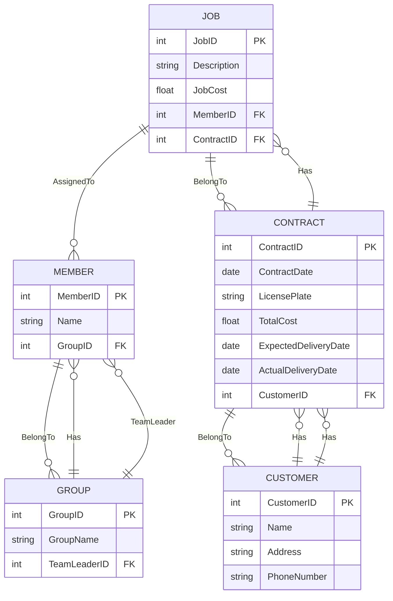
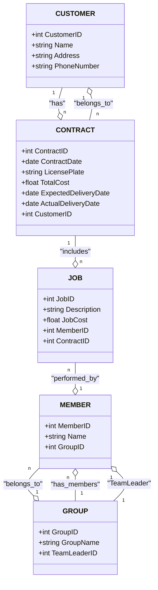

Entities:

- Member: MemberID, Name, GroupID (FK to Group)
- Group: GroupID, GroupName, TeamLeaderID (FK to Member)
- Job: JobID, Description, JobCost, MemberID (FK to Member)
- Contract: ContractID, ContractDate, LicensePlate, TotalCost, ExpectedDeliveryDate, ActualDeliveryDate, CustomerID (FK to Customer)
- Customer: CustomerID, Name, Address, PhoneNumber

---

Relationships:

- Group - Member (1-n): A group has many members (GroupID in Member is a FK).
- Member - Group (1-1): Each member belongs to only one group.
- Group - Member (1-1, TeamLeader): Each group has one team leader (TeamLeaderID is a FK).
- Contract - Job (1-n): A contract can have multiple jobs (ContractID in JobContract is a FK).
- Job - Contract (n-1): A job belongs to one contract (ContractID in Job is a FK).
- Member - Job (1-n): Each job is performed by one mechanic (MemberID in Job is a FK).
- Customer - Contract (1-n): A customer can have multiple contracts (CustomerID in Contract is a FK).
- Contract - Customer (n-1): A contract belongs to one customer (CustomerID in Contract is a FK).

ERD (Entity Relationship Diagram):

CD:

