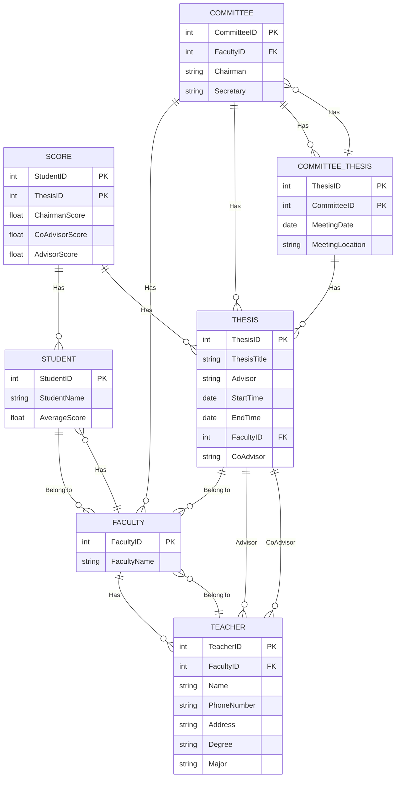
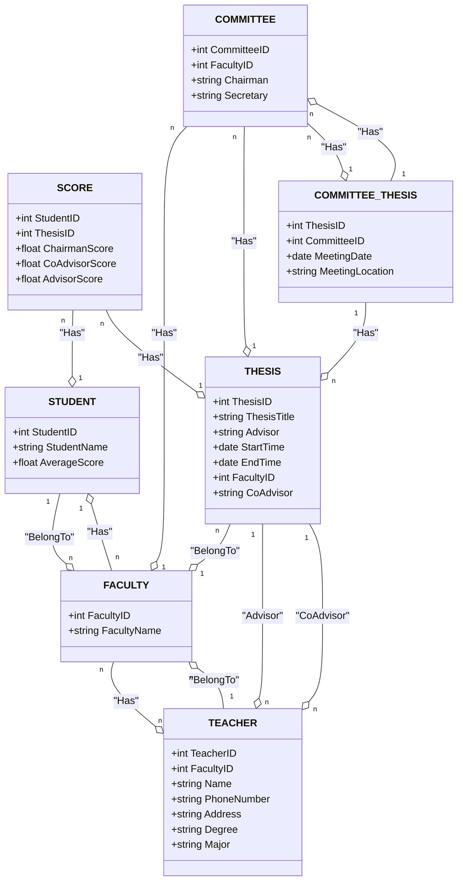

Question:
Người ta cần tin học hoá khâu Quản lí các đề tại tốt nghiệp của 1 trường ĐH.
Với các thông tin sau :
Mỗi SV năm 4 sẽ làm đề tài TN. Mỗi đề tài bao gồm Tên DT, giáo viên hướng
dẫn, thời gian bắt đầu, kết thúc, thuộc khoa nào.
Khoa sẽ thành lập hội đồng khoa học, mỗi HĐ gồm: Chủ tịch, 1 thành viên thư
kí , ngày bảo vệ tại địa chỉ cụ thể. Mỗi đề tài sẽ bảo vệ tại một hội đồng, điểm
đề tài là trung bình cộng của: Chủ tịch , 01 GV phản biện, 01 GV hướng dẫn.
Giáo viên cho điểm theo từng Sinh viên mặc dù các sinh viên có thể làm chung
đề tài
Trong đợt bảo vệ có thể có nhiều hội đồng, 1 GV có thể hướng dẫn nhiều DT,
hay phản biện nhiều DT. Chủ tịch HD, thư ký là giáo viên. Mỗi giáo viên cần
thông tin: Tên , địa chỉ ,SDT , học vị , chuyên ngành
Mỗi DT có thể tối đa 03 Sinh viên thực hiện. SV có điểm TB<5 sẽ phải bảo vệ
lại với khóa sau và chỉ được bảo vệ tối đa 2 lần, đề tài lần 1 phải khác lần 2.

---

Relational Database Design:

- Student (StudentID, StudentName, AverageScore)
- Faculty (FacultyID, FacultyName)
- Teacher (TeacherID, FacultyID, Name, PhoneNumber, Address, Degree, Major)
- Thesis (ThesisID, ThesisTitle, Advisor, StartTime, EndTime, FacultyID, CoAdvisor)
- Score (StudentID, ThesisID, ChairmanScore, CoAdvisorScore, AdvisorScore)
- Committee (CommitteeID, FacultyID, Chairman, Secretary)
- CommitteeThesis (ThesisID, CommitteeID, MeetingDate, MeetingLocation)

Relationships:

- Student - Faculty (n-1)
- Faculty - Student (1-n)
- Faculty - Teacher (1-n)
- Teacher - Faculty (n-1)
- Thesis - Faculty (n-1)
- Thesis - Teacher (1-n, Advisor)
- Thesis - Teacher (1-n, CoAdvisor)
- Score - Student (n-1)
- Score - Thesis (n-1)
- Committee - Faculty (n-1)
- Committee - Thesis (1-n)
- Committee - CommitteeThesis (1-n)
- CommitteeThesis - Thesis (1-n)
- CommitteeThesis - Committee (1-n)

---

ERD (Entity Relationship Diagram):

CD:

