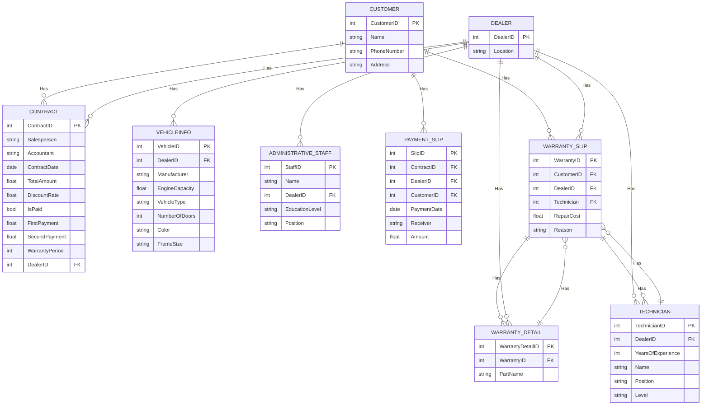

Relational Database Design:

- CUSTOMER (**CustomerID**, Name, PhoneNumber, Address)					
- DEALER (**DealerID**, Location)								
- VEHICLEINFO (**VehicleID**, **DealerID**, Manufacturer, EngineCapacity, VehicleType, NumberOfDoors, Color, FrameSize)						
- ADMINISTRATIVE_STAFF (**StaffID**, Name, **DealerID**, EducationLevel, Position)								
- TECHNICIAN (**TechnicianID**, **DealerID**, YearsOfExperience, Name, Position, Level)								
- CONTRACT (**ContractID**, Salesperson, Accountant, ContractDate, TotalAmount, DiscountRate, IsPaid, FirstPayment, SecondPayment, WarrantyPeriod, **DealerID**)								
- PAYMENT_SLIP (**SlipID**, **ContractID**, **DealerID**, **CustomerID**, PaymentDate, Receiver, Amount)						
- WARRANTY_SLIP (**WarrantyID**, **CustomerID**, **DealerID**, Technician, RepairCost, Reason)							
- WARRANTY_DETAIL (**WarrantyDetailID**, **WarrantyID**, PartName)

Relationships:

- CUSTOMER - CONTRACT (1-n)
- DEALER - VEHICLEINFO (1-n)
- DEALER - ADMINISTRATIVE_STAFF (1-n)
- DEALER - TECHNICIAN (1-n)
- DEALER - CONTRACT (1-n)
- CUSTOMER - PAYMENT_SLIP (1-n)
- CUSTOMER - WARRANTY_SLIP (1-n)
- WARRANTY_SLIP - WARRANTY_DETAIL (1-n)
- DEALER - WARRANTY_SLIP (1-n)
- DEALER - WARRANTY_DETAIL (1-n)
- TECHNICIAN - WARRANTY_SLIP (1-n)
- WARRANTY_SLIP - TECHNICIAN (1-n)
- WARRANTY_DETAIL - WARRANTY_SLIP (1-1)

---

ERD (Entity Relationship Diagram):

CD

